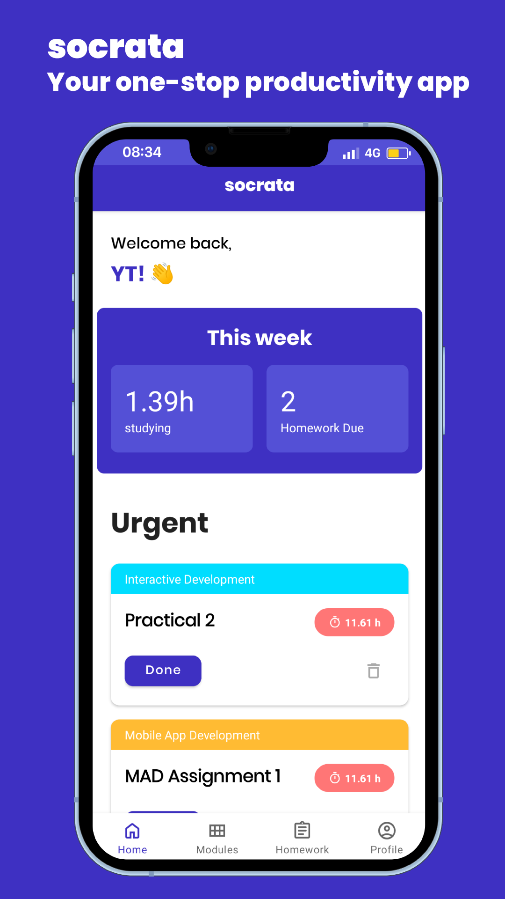
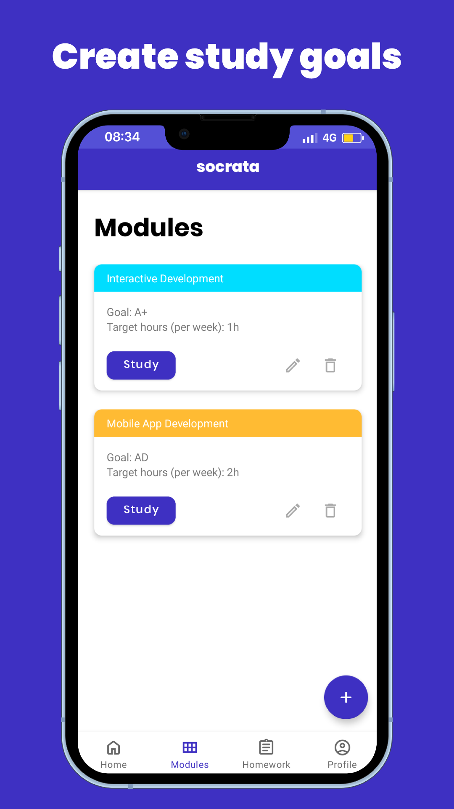
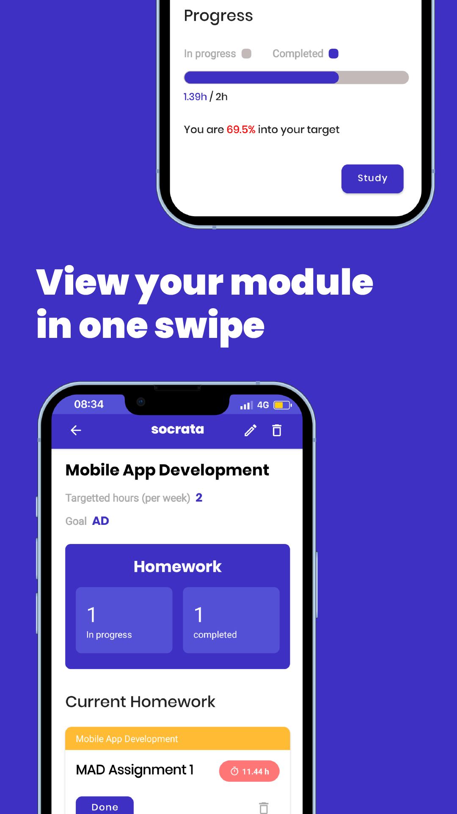
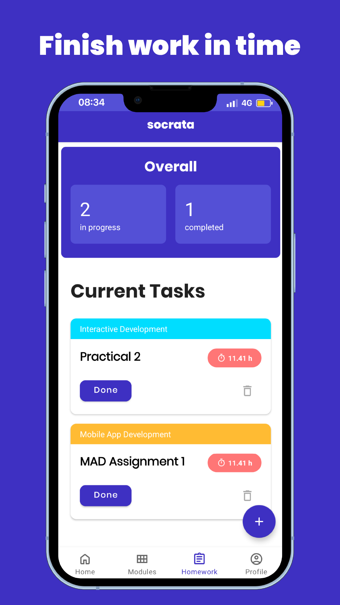

# socrata - study better

## Team:
- Leo Yun Tao (10219150H)
- Ng Ray Zin (10222457H)
- Shuqri Bin Shaifuddin (10227932G)
- Elliot Ng

## Description:
Track your homework and study times in one app.

An assignment for partial fulfilment of the coursework of Mobile Applications development AY2022/23 in Ngee Ann Polytechnic

Socrata is a FREE student productivity app that enables you to stay on track and keep you stress free!

A numbered progress section allows you to see a brief overview of the current week's progress! Take care of urgent tasks needed to be completed by the week!

Study for your modules with our in-built stopwatch! Add goals to keep you focused!

Create new homework tasks to stop your procrastination!

## Contributions/roles:

###Leo Yun Tao (backend + frontend): 
- basically everything 
- improve code on everything
- homework 
- backend of home page 
- login/sign-up page
- study timer
- set up firebase
- quote notification
- firebase
- slides

### Ng Ray Zin (backend + frontend): 
- whole of module (create, edit, info)
- moderate amount on homework
- homepage design
- introduction sliders/user guide
- firebase
- slides

### Shuqri Bin Shaifuddin (backend + frontend + google play console guy): 
- everything in profile
- homework design
- navigation bar
- design and screen shot for google play store
- upload and update app in google play store
- set up github
- firebase

### Elliot (lost): 
- nothing
- joined google developers
- pulled code from github

## Appendix:

### Prototypes:
https://www.figma.com/file/QRCPsSVYvD4QMdfuZrFKYs/User-Stories-map?node-id=0%3A1

### User Guide:

- User should login/signup to use the application
- Users can create, edit and delete modules
- Users can only create homework if they had already made a module
- Users can click into the modules made to see module information
- Users can record study sessions to hit their set study goal
- Users may edit/ delete their account

## Screenshots:

### Home:

### modules:

### module (create/edit):

### module(info):

### homework:

### homework(create):

### study timer:
